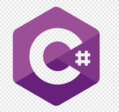

<h1 align="center">Hi 👋, I'm Omer Priel</h1>

<h3 align="center">Software Developer, Freelancer and Student</h3>

<h4 align="center">Warning, this profile created for my personal happiness</h4>

  

- 💬 Ask me about **Python, FastAPI** or any **Language** / **Technology** / **Tool** that mentioned in this **README**.

- 🌱 I’m currently contributing to [mermaid](https://mermaid.js.org/) \
  I'm Back-End, and still contribute to it (I don't have much time  lately). \
  Because, it's a tool I like to use in most of the time.

- 🔭 I’m currently working as final projects for the last year in the University

- 📫 Reach me by email **omer.priel2@gmail.com**

<h3 align="left">Linkedin:</h3>

  

<h3>Languages (Arranged in the order I learned them):</h3>

  
  
  
  
  
  
  
  
  
  
  

<h3>Technologies and Tools (in no particular order):</h3>

  
  
  
  
  
  
  
  
  
  
  
  
  <a href="https://github.com/" target="_blank">
    
  
  
  
  
  
  
  
  
  
  
  
  
  
  
  
  
  
  
  
  
  
  
  
  
  
  
  
  
  
  
  

