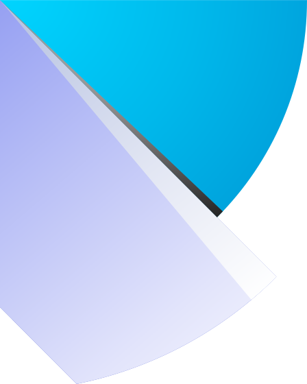

<h1 align="center">Hi 👋, I'm Omer Priel</h1>

<h3 align="center">Software Engineer Freelancer</h3>

<h4 align="center">Warning, this profile created for my personal happiness</h4>

- 💬 Ask me about **Python, FastAPI, Django, TypeScript, React** or any **Language** / **Technology** / **Tool** that mentioned in this **README**.

- I am currently working for [EasyFarm](http://easyfarm.co.il/) as a Back-End Developer.

- Love [mermaid](https://mermaid.js.org/) for planning and explaining.

```mermaid
graph LR;
  Example --> Of
  Of --> Mermaid
  Mermaid --> In
  In --> GitHub[GitHub 🤣]
```



- 📫 Reach me by email **omer.priel2@gmail.com** or by WhatsApp to **(+972) 058-6656434**

⚡ Fun facts
* I saw my older brother programming his first hour (Hello World) and after that hour I started learning and developing until today. And he didn't touch programing for over 3 years after that Hello World.
* I am **Linux Mint** and love it. But I choose it, since it looked like **Windows** for me.

### Linkedin:
<p align="left">
  <a href="https://www.linkedin.com/in/omer-priel/" target="_blank">
    
  </a>
</p>

### Projects:

### Work

- [EasyFarm](http://easyfarm.co.il/) - Online store and management for farms and businesses

<!-- ### Open Source

- [mermaid](https://mermaid.js.org/) - A open source tool for creating diagrams that I love and contribute to it. Created with **JavaScript**.

mermaid
graph LR;
  Example -> Of
  Of -> Mermaid
  Mermaid -> In
  In -> GitHub[GitHub 🤣]
```
-->

#### For university

- [university-networking-final](https://github.com/omer-priel/university-networking-final) - File transfer Protocol like FTP based on RUDP (Reliable UDP) that created from scratch in **python**. and it Final Project for networking (contains other tasks).

- [university-TheRootOfDataScience](https://github.com/omer-priel/university-TheRootOfDataScience) - ML project for university. In theory it was about ML, but in practice most of the time was about Web Scraping that we dos on **yelp**. Created with **beautifulsoup4**, **Splash**, **selenium**, and **scikit-learn**.

- [university-algo2](https://github.com/omer-priel/university-algo2) - Implementations of graph based algorithms with full GUI for the user to understand the algorithms. created by **python**, **networkx**, **matplotlib**, and **tkinter**. The algorithms:
  * Brooks
  * Edmonds Blossom
  * Hungarian
  * DFS (only as simple example for the GUI)

- [equal-shares](https://github.com/equal-shares/equal-shares/) - A voting system for the Student Union in the university based on the algoritem Method of Equal Shares, Created with **FastAPI**, **React**, **PostgreSQL**, **Docker**, **Nginx**, **GitHub Actions**. BTW, this project is currently in development and integration with the university.

- [solutrain](https://github.com/omer-priel/solutrain) - A mobile app and API server for meetings of coaches and trainers. Created with **FastAPI** (python), **Flutter** (dart), and **PostgreSQL**.

- [walmart-sales-prediction](https://github.com/LiorShiboli/walmart-sales-prediction) - Deep Learning project for university. To predict walmart's profit for each department in each store for the coming week when we have the information up to that week. Created with **Python**, **PyTorch**, **Pandas**, **Numpy**, and **Matplotlib**.

#### For myself

- [madabclick](https://github.com/omer-priel/madabclick) - Like to the website: [madabclick-frontend.onrender.com](https://madabclick-frontend.onrender.com). **madabclick** is a website for children that contains quality content that selected by graduates of odyssey. It created because of the war. Created with **NextJS** (**React**), **AWS**, **Terraform** and **Docker**.

- [Control](https://github.com/omer-priel/Control) - It was my first real project that I created in 2015. A two programs for contolling of other computers without the other computer to konw about it. One is the contoller and he has GUI for see the sceens, keyboard and can send commands to the other computer by other program that run on the other computer. Created with **C#**. 

- [VirtualComputer](https://github.com/omer-priel/VirtualComputer) - Application based on the VM consept. Its work like the terminal (CMD), But save the data on custom "Virtual Hard Drive" file (.vhd) with format that I desined. Created with **C++**.

- [NewWorld](https://github.com/omer-priel/NewWorld) - It a game engine that created from scratch (only GLM) that contains full GUI system for debug and the developemt itself. But I didn't have time (I moved to Back End and leave the 3D world) to continue and end it. Created with **C++** and **OpenGL**.

- [LogisticSaloon](https://github.com/omer-priel/LogisticSaloon) - A website for seeing logistic reports that created for Hackathon in IDF. It build with Vue.

- [BuildingEscape](https://github.com/omer-priel/BuildingEscape) - A simple Building Escape game that created with **Unreal Engine 4**.

### Languages (Arranged in the order I learned them):
<p>
  <a href="https://learn.microsoft.com/en-us/dotnet/csharp/tour-of-csharp/" target="_blank">
    
  </a>
  <a href="https://en.wikipedia.org/wiki/X86_assembly_language" target="_blank">
    
  </a>
  <a href="https://www.java.com/en/" target="_blank">
    
  </a>
  <a href="https://developer.mozilla.org/en-US/docs/Web/JavaScript" target="_blank">
    
  </a>
  <a href="https://www.php.net/" target="_blank">
    
  </a>
  <a href="https://www.typescriptlang.org/" target="_blank">
    
  </a>
  <a href="https://en.wikipedia.org/wiki/C_(programming_language)" target="_blank">
    
  </a>
  <a href="https://cplusplus.com/" target="_blank">
    
  </a>
  <a href="https://www.python.org/" target="_blank">
    
  </a>
  <a href="https://dart.dev/" target="_blank">
    
  </a>
  <a href="https://racket-lang.org/" target="_blank">
    
  </a>
</p>


### Technologies and Tools (in no particular order):
<p>
  <a href="https://mermaid.js.org/" target="_blank">
    
  </a>
  <a href="https://obsidian.md/" target="_blank">
    
  </a>
  <a href="https://fastapi.tiangolo.com/" target="_blank">
    
  </a>
  <a href="https://www.djangoproject.com/" target="_blank">
    
  </a>
  <a href="https://expressjs.com/" target="_blank">
    
  </a>
  <a href="https://www.docker.com/" target="_blank">
    
  </a>
  <a href="https://editorconfig.org/" target="_blank">
    
  </a>
  <a href="https://mypy-lang.org/" target="_blank">
    
  </a>
  <a href="https://www.terraform.io/" target="_blank">
    
  </a>
  <a href="https://aws.amazon.com/" target="_blank">
    
  </a>
  <a href="https://cloud.google.com/" target="_blank">
    
  </a>
  <a href="https://git-scm.com/" target="_blank">
    
  </a>
  <a href="https://github.com/" target="_blank">
    
  <a href="https://github.com/features/actions" target="_blank">
    
  </a>
  <a href="https://bitbucket.org/" target="_blank">
    
  </a>
  <a href="https://docs.conda.io/en/latest/" target="_blank">
    
  </a>
  <a href="https://python-poetry.org/" target="_blank">
    
  </a>
  <a href="https://nodejs.org/en" target="_blank">
    
  </a>
  <a href="https://www.npmjs.com/" target="_blank">
    
  </a>
  <a href="https://yarnpkg.com/" target="_blank">
    
  </a>
  <a href="https://www.gnu.org/software/bash/" target="_blank">
    
  </a>
  <a href="https://en.wikipedia.org/wiki/Linux" target="_blank">
    
  </a>
  <a href="https://jupyter.org/" target="_blank">
    
  </a>
  <a href="https://numpy.org/" target="_blank">
    
  </a>
  <a href="https://pandas.pydata.org/" target="_blank">
    
  </a>
  <a href="https://matplotlib.org/" target="_blank">
    
  </a>
  <a href="https://www.postman.com/" target="_blank">
    
  </a>
  <a href="https://www.selenium.dev/" target="_blank">
    
  </a>
  <a href="https://www.postgresql.org/" target="_blank">
    
  </a>
  <a href="https://www.mysql.com/" target="_blank">
    
  </a>
  <a href="https://www.sqlite.org/index.html" target="_blank">
    
  </a>
  <a href="https://www.mongodb.com/" target="_blank">
    
  </a>
  <a href="https://redis.io/" target="_blank">
    
  </a>
  <a href="https://developer.mozilla.org/en-US/docs/Web/HTML" target="_blank">
    
  </a>
  <a href="https://developer.mozilla.org/en-US/docs/Web/CSS" target="_blank">
    
  </a>
  <a href="https://tailwindcss.com/" target="_blank">
    
  </a>
  <a href="https://nextjs.org/" target="_blank">
    
  </a>
  <a href="https://react.dev/" target="_blank">
    
  </a>
  <a href="https://storybook.js.org/" target="_blank">
    
  </a>
  <a href="https://redux.js.org/" target="_blank">
    
  </a>
  <a href="https://flutter.dev/" target="_blank">
    
  </a>
  <a href="https://wordpress.org/" target="_blank">
    
  </a>
  <a href="https://vuejs.org/" target="_blank">
    
  </a>
  <a href="https://www.opengl.org/" target="_blank">
    
  </a>
  <a href="https://www.unrealengine.com/en-US" target="_blank">
    
  </a>
</p>
